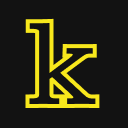
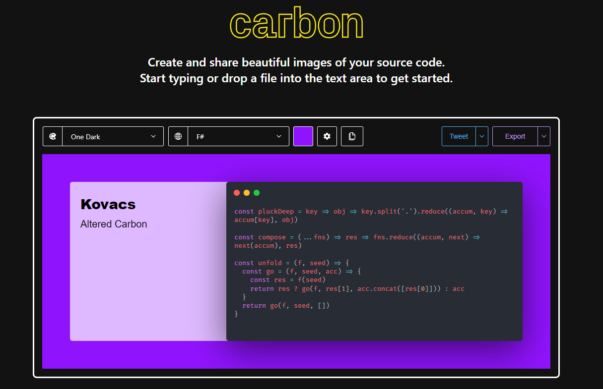

# Kovacs: Altered Carbon

Browser extension that adds a side card panel to [Carbon](https://carbon.now.sh/) to include some title and description to your beautiful source code.

---
#### Why Kovacs?
Kovacs is the name of the main character from Altered Carbon. 

